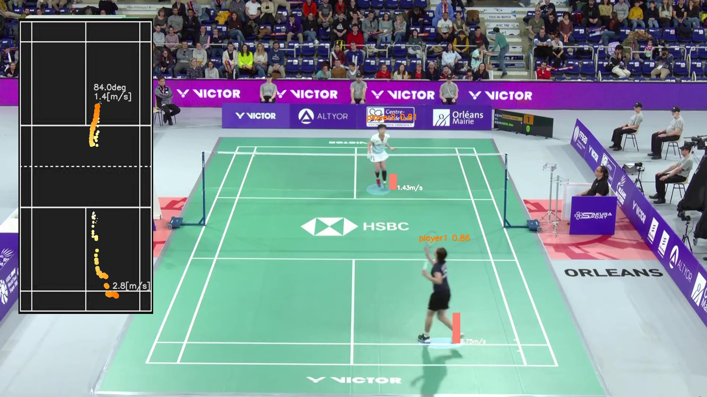
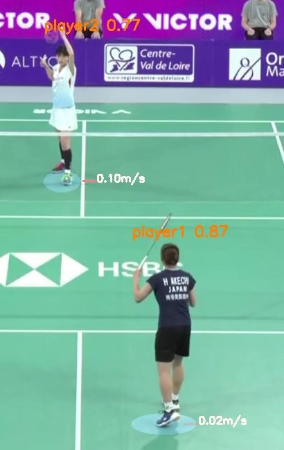
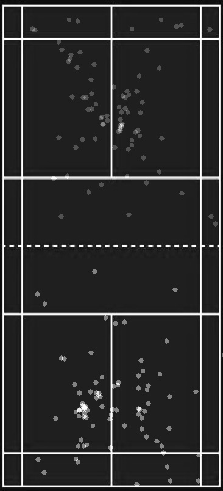
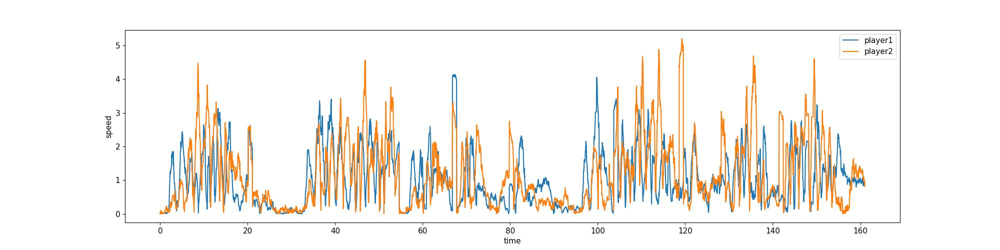
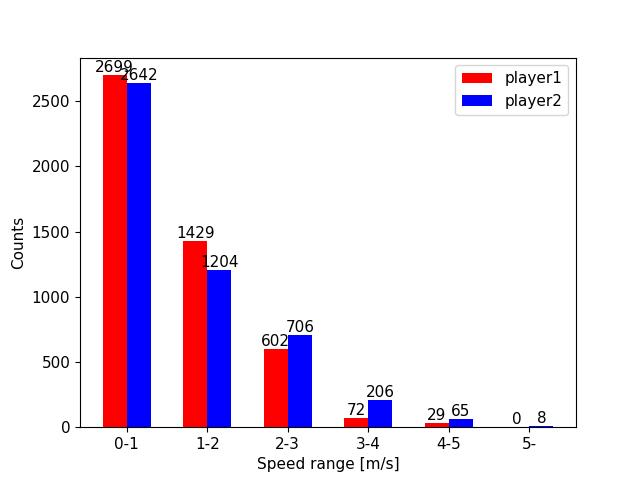
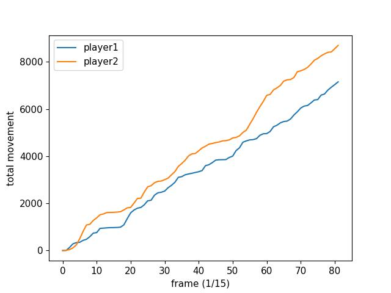

# バドミントンの試合分析システム

バドミントンの試合動画から選手の分析ができるシステムを作りました。

### このシステムによって出力される動画

YouTubeにサンプル動画をアップロードしています。

    -リンク-

- 画面左に、上から見た際の選手の位置が表示されます。直感的にわかりやすくなると思います。
- 画面左のコートと選手の足元に移動速度が表示されます。選手の足元にあるバーは速度によって長さが変動します。
- 画面左のコートに移動角度が表示されます。今のところ、特に活用はしていません。

動画の切り取り

 

# 現在の機能

まだ分析できる内容が少ないので、これから増やしていきたいです。

### 1. 選手の検出

学習済みYOLOv5を用いて選手を検出しています。観客や審判も検出されてしまうので、コート上の人間のみに限定しています。

### 2. 選手の位置分布

画面左に表示されるコート上の位置を一定間隔で記録しています。以下の画像は２秒間隔で記録したものです。 
バドミントンはショットを打つたびに真ん中に戻るので真ん中付近に点が集中しています。

### 3. 移動速度の計測

画面左に表示されるコート上の位置座標をもとに速度を計算し、指定フレーム間隔で記録しています。
$$speed = \frac{\text{現在の位置座標} - \text{指定フレーム数前の位置座標}}{\text{指定フレーム数}/FPS}$$

以下のグラフは、反映するフレーム数: 30、FPS: 30 の時の移動速度時系列グラフです。青が手前の選手、オレンジが奥の選手を示しています。

プレイ中でないときは移動速度が遅いので、これによりプレイ中かどうか判定できるかもしれません。

### 4. 移動速度の傾向

移動速度を 1m/s 間隔のカテゴリに分け、移動速度を計算するたびに該当するカテゴリのカウンタを加算しています。

以下の画像が移動速度の傾向を示した棒グラフです。赤が手前の選手、青が奥の選手を示しています。横軸が移動速度のカテゴリ、縦軸がカウント数です。 
青の選手は比較的移動速度が速いということがわかります。

### 5. 総移動距離の計測

画面左に表示されるコート上の位置座標をもとに移動距離を計算し、指定フレーム間隔で加算しています。距離はメートルではないので、今後修正すると思います。

以下の画像は選手の移動距離の累積分布です。オレンジが奥の選手、青が手前の選手を示しています。オレンジの選手の方が多く動いていることがわかります。

 

# 今後追加したい機能

- シャトルの検出 
    ↳ ショットの種類認識 
    ↳ シャトルが落ちた位置の特定 
    　↳ ショットの精度分析 
    　↳ ミスの傾向分析 

- 選手のモーション認識 
    ↳ ショットの種類認識 

- 試合動画を自動で1プレイずつに分割 
    ↳ 似ているプレイをまとめる 
    ↳ ミスをした場所の抽出 
